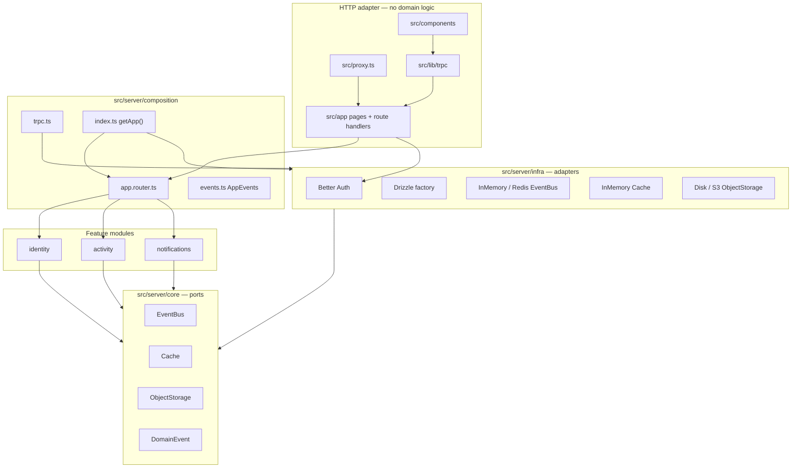
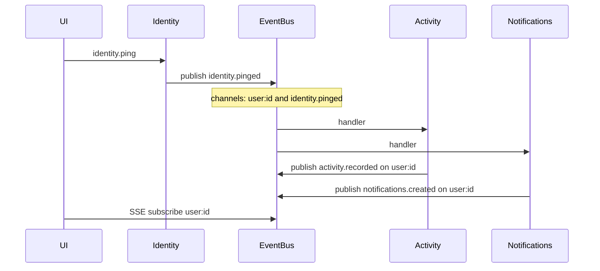

# Architecture

Anzen is one Node process (or several identical replicas behind nginx). Modules are folders and import rules, not separate services.

## Monolith



## Directory map

```
src/
  app/                 Next.js pages and Route Handlers (HTTP)
  components/          Client UI, grouped by module name
  lib/trpc/            Browser tRPC + React Query provider
  proxy.ts             Cookie-based redirects (Next 16 proxy)
  server/
    index.ts           Re-exports composition (getApp, AppRouter)
    composition/       Wires modules, tRPC context, typed EventBus catalog
    config/env.ts      Zod-parsed env (providers, secrets, URLs)
    common/            Shared errors, no framework
    core/              Ports: EventBus, Cache, ObjectStorage, DomainEvent, ids
    infra/             Adapters: auth, database, event-bus, cache, object-storage
    modules/
      <name>/
        index.ts       Public API — createXModule + re-exported contract
        contract.ts    Event catalog only (composition imports this to avoid cycles)
        domain/
          events.ts    Event names + Zod payloads — the cross-module contract
        application/   Use cases taking ports
        interfaces/    tRPC routers
        infra/         Optional module-private adapters
```

Aliases: `@/*` → `src/*`. Module public API also has `@/modules/<name>` → that module’s `index.ts`.

## Request paths

**Pages** (`/`, `/sign-in`, `/sign-up`, `/dashboard`) render React. Dashboard is a server page that checks Better Auth, then mounts client panels.

**tRPC** `GET|POST /api/trpc` → `fetchRequestHandler` → `appRouter` + `createTRPCContext`. Context always includes `{ db, session, eventBus, cache, storage }` where `eventBus` is `EventBus<AppEvents>`. `protectedProcedure` throws `UNAUTHORIZED` without a session.

**Auth** `GET|POST /api/auth/[...all]` → Better Auth. Browser client: `src/components/identity/auth-client.ts`.

**Files** `GET /api/files/[...key]` requires a session, then `storage.get(key)`. Object `url()` returns this path so auth stays on the app, even if a future S3 adapter stores bytes elsewhere.

**Proxy** (`src/proxy.ts`): no session cookie on `/dashboard` → `/sign-in`; session cookie on sign-in/up → `/dashboard`. Optimistic only — procedures still check the session.

## Cross-module events

Modules do not import each other’s application code. Each module owns a Zod **event catalog** in `domain/events.ts`. Composition merges catalogs into `AppEvents` and wraps the infra bus so `publish` / `subscribeTo` infer payload types.

A producer `publish`es `createDomainEvent({ type, payload, channels })`. Include the event type string as a channel so `subscribeTo(type)` works. Include `user:${userId}` when the browser should SSE.

Consumers call `eventBus.subscribeTo("identity.pinged", (event) => …)` in `start()`. `event.payload` is `IdentityPingedPayload`. Runtime Zod parse happens in the typed wrapper (Redis JSON).



`EVENT_BUS_PROVIDER=memory` fans out in-process. `redis` uses Pub/Sub for live handlers (SSE + `start()` subscribers) and `XADD`s to streams for a future worker. Same module code either way.

In-memory **cache** is per process. Redis EventBus does **not** share activity/notifications lists across replicas; live SSE does.

## Layer rules (enforced)

| From | Must not import | Enforced by |
| --- | --- | --- |
| `src/server/modules/A/` | `src/server/modules/B/{application,domain,infra,interfaces}/` | Biome `noRestrictedImports` + depcruise |
| `src/server/infra/` | `src/server/modules/`, `src/server/composition/` | depcruise |
| `src/server/core/` | `infra`, `modules`, `config`, `composition` | depcruise |
| `src/server/composition/` | module `application/` / `infra/` / `interfaces/` (use `contract.ts` or `@/server/modules/<name>`) | depcruise |

`bun run arch` is part of `bun run lint`. Treat a depcruise failure as a broken PR.

## Runtime notes

- API routes set `runtime = "nodejs"` and `dynamic = "force-dynamic"`. tRPC subscriptions need a long-lived Node server (`maxDuration = 60` on the tRPC route). Not Vercel Edge.
- Native / CJS clients are listed in `next.config.ts` `serverExternalPackages`: `better-sqlite3`, `postgres`, `mysql2`, `redis`, `@aws-sdk/client-s3`.
- Factories cache instances on `globalThis` so Next HMR and multi-import graphs share one bus/db/auth.
- Drizzle schema is **per dialect** under `src/server/infra/database/schema/{sqlite,postgresql,mysql}.ts`. `drizzle.config.ts` picks schema + `drizzle/<provider>/` output from env. Better Auth 1.7 `account.issuer` must stay in all three.
